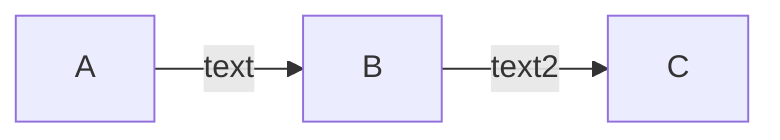

<!--more-->
<!--上面设置的是内容摘要，展现的是“more"到上面的前置参数之间的内容，Hugo 默认会将内容的前 70 个单词作为摘要，此默认摘要的字数可以在config.toml文件中设置summaryLength的值来更改。-->
# 代码（一级标题）
## 行内代码（二级标题 ）
示例（默认）：`name`

输出：name

此外，行内代码样式还有其他 5 种颜色可供选择，在原文本之后加上(参数)即可，中间用空格分隔，且必须是1个空格：


\`name (danger)\`  
`name (danger)`

\`name (success)\`    
`name (success)`

\`name (tip)\`  
`name (tip)`

\`name (warning)\`  
`name (warning)`

\`name (danger)\`  
`name (danger)`

## 代码块
在代码的第一行加上`close`，当页面刷新时，此代码块将显示为关闭状态，这在代码很长且占用空间时很有用。
```markdown
    ```python
    close
    import re
    a = 5
    b = 6
    ```
```    
输出（点击可打开）：  

```python
import re  
a = 5  
b = 6   
```  

# 引用

示例（默认）：
```markdown
> 我是一个段落
```

输出：
> 我是一个段落

拥有 5 种颜色的选择，使用方法很简单，像下面这样增加一个参数就行：

```markdown
> primary
> 我是一个 primary 的段落。

> success。
> 我是一个 success 的段落。

> tip
> 我是一个 tip 的段落。

> warning
> 我是一个 warning 的段落。

> danger
> 我是一个 danger 的段落。
```
注意：参数行与内容行之间不能有空白行。  
> primary
> 我是一个 primary 的段落。

> success。
> 我是一个 success 的段落。

> tip
> 我是一个 tip 的段落。

> warning
> 我是一个 warning 的段落。

> danger
> 我是一个 danger 的段落。

# 图片

默认情况下图片自带阴影，如不想要阴影，在引号内的文本之后添加_no即可（例：'title_no'）。没有标题时则是这样：'_no'。

1.标题 + 阴影
```markdown

```
输出：


2.标题 + 无阴影
```markdown

```
输出：


3.无标题 + 阴影
```markdown

```
输出：


4.无标题 + 无阴影
```markdown

```
输出：


# tabs（选项卡）
## 示例
这是一个选项卡示例：

::: tabs 
  
@tab 标题一 
  
内容一
  
@tab 标题二
  
内容二
  
@tab 标题三
  
内容三
  
:::
  
## 用法
以`::: tabs`和`:::`作为选项卡容器的起始和结束，用`@tab`来标记和分隔不同选项卡，`@tab`之后是标题，默认情况下会激活第一个选项卡，你也可以在`@tab`之后添加文本`:active`来默认激活相应的选项卡。

1.例1
```markdown
    <!-- 空白行（必须） -->
::: tabs <!-- ':::' 和 'tabs' 之间必须有且只有 1 个空格 -->
    <!-- 空白行（必须） -->
@tab 李小龙 <!-- '@tab' 和标题之间必须有且只有 1 个空格 -->
    <!-- 空白行（必须） -->
《猛龙过江》《龙争虎斗》《唐山大兄》《精武门》
    <!-- 空白行（必须） -->
@tab 吴京
    <!-- 空白行（必须） -->
《战狼2》《战狼》《流浪地球》
    <!-- 空白行（必须） -->
@tab 甄子丹
    <!-- 空白行（必须） -->
《叶问》《导火线》《追龙》
    <!-- 空白行（必须） -->
:::
    <!-- 空白行（必须） -->
```

2.例2（添加了:active）
```markdown

::: tabs

@tab 李小龙

《猛龙过江》《龙争虎斗》《唐山大兄》《精武门》

@tab:active 吴京

《战狼2》《战狼》《流浪地球》

@tab 甄子丹

《叶问》《导火线》《追龙》

:::

```

输出：

::: tabs

@tab 李小龙

《猛龙过江》《龙争虎斗》《唐山大兄》《精武门》

@tab:active 吴京

《战狼2》《战狼》《流浪地球》

@tab 甄子丹

《叶问》《导火线》《追龙》

:::

---   <!--分割线-->
你可以为选项卡容器添加一个id：

```markdown

::: tabs#install

:::

```

有相同 id 的选项卡容器中，标题相同的选项卡将共享相同的切换事件，下面是两个有相同 id 的选项卡容器例子，试着点击不同选项卡看看效果：

```markdown

::: tabs#install

@tab npm

用 npm 安装 xxx

@tab Homebrew

用 Homebrew 安装 xxx

@tab MacPorts

用 MacPorts 安装 xxx

:::

```

```markdown

::: tabs#install

@tab npm

用 npm 安装 yyy

@tab Homebrew

用 Homebrew 安装 yyy

@tab MacPorts

用 MacPorts 安装 yyy

:::

```

输出：

::: tabs#install

@tab npm

用 npm 安装 xxx

@tab Homebrew

用 Homebrew 安装 xxx

@tab MacPorts

用 MacPorts 安装 xxx

:::


::: tabs#install

@tab npm

用 npm 安装 yyy

@tab Homebrew

用 Homebrew 安装 yyy

@tab MacPorts

用 MacPorts 安装 yyy

:::


# mermaid
mermaid 可绘制图表和流程图，用法很简单，像代码块一样：
```markdown
    ```mermaid
    内容
    ```
```

示例：
```markdown
    ```mermaid
    flowchart LR
        A -- text --> B -- text2 --> C
    ```
```

输出：


# math
基于 mathjax 的数学公式编辑

## 行内公式
示例：
```markdown
    ```math
    <!-- 用 '\(' 和 '\)' 表示行内公式的起始和结束 -->
    这是一个行内公式：\( x = {-b \pm \sqrt{b^2-4ac} \over 2a} \)
    ```
```
输出：
```math
    <!-- 用 '\(' 和 '\)' 表示行内公式的起始和结束 -->
    这是一个行内公式：\( x = {-b \pm \sqrt{b^2-4ac} \over 2a} \)
```

## 公式块
示例：
```markdown
    ```math
    <!-- 用 '$$' 和 '$$' 表示公式块的起始和结束 -->
    这是一个公式块：$$ x = {-b \pm \sqrt{b^2-4ac} \over 2a} $$
    ```
```
输出：
```math
    <!-- 用 '$$' 和 '$$' 表示公式块的起始和结束 -->
    这是一个公式块：$$ x = {-b \pm \sqrt{b^2-4ac} \over 2a} $$
```


12s316313